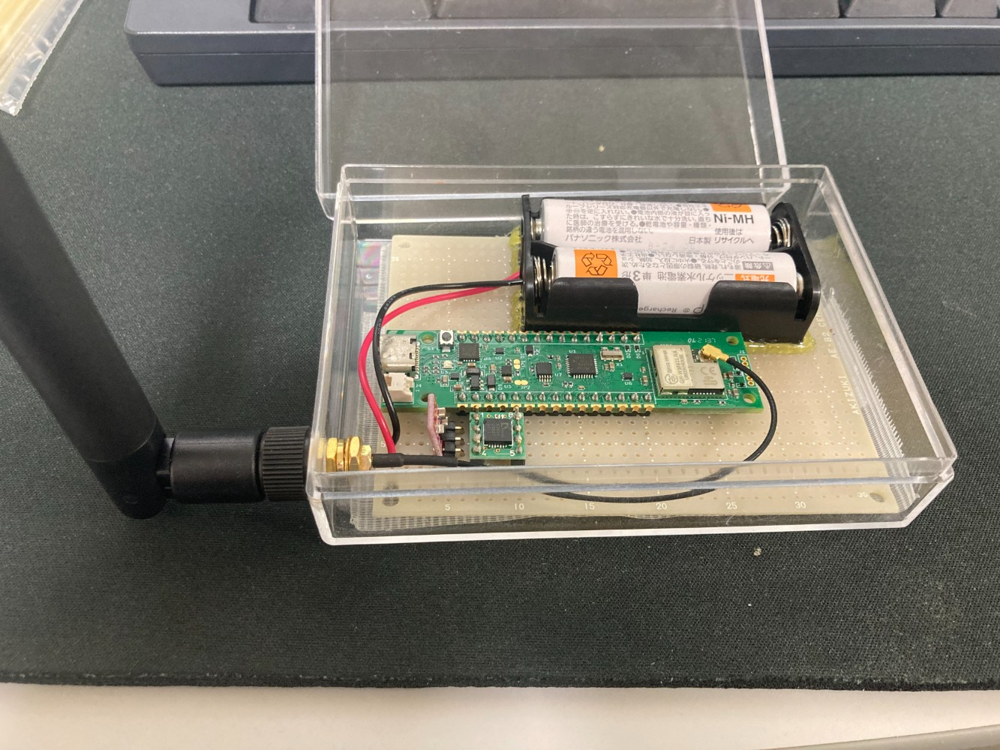

## 目次
- [必要なもの](#必要なもの)
- [完成イメージ](#完成イメージ)
- [配線例](#配線例)
- [ケース加工](#ケース加工)
- [コード](#コード加工)

## 必要なもの
- ユニバーサル基板
	- [https://akizukidenshi.com/catalog/g/gP-03230/](https://akizukidenshi.com/catalog/g/gP-03230/)  
- プラスチックケース
	- [https://akizukidenshi.com/catalog/g/gP-03230/](https://akizukidenshi.com/catalog/g/gP-03230/)  
- 電池ボックス
	- [https://akizukidenshi.com/catalog/g/gP-10196/](https://akizukidenshi.com/catalog/g/gP-10196/)  
- LoRa搭載Arduino-Nano互換ボード
	- [https://www.green-house.co.jp/products/gh-evardlrb/](https://www.green-house.co.jp/products/gh-evardlrb/)  
- 加速度センサモジュール(KXR94-2050)
	- [https://akizukidenshi.com/catalog/g/gM-05153/](https://akizukidenshi.com/catalog/g/gM-05153/)  
- 3.3V DC/DC
	- [https://akizukidenshi.com/catalog/g/gK-13066/](https://akizukidenshi.com/catalog/g/gK-13066/)  
- ピンヘッダ
	- [https://akizukidenshi.com/catalog/g/gC-04398/](https://akizukidenshi.com/catalog/g/gC-04398/)  
- 温湿度センサ
	- [https://akizukidenshi.com/catalog/g/gM-07002/](https://akizukidenshi.com/catalog/g/gM-07002/)  
- 抵抗(10kΩ)
	- [https://akizukidenshi.com/catalog/g/gR-25103/](https://akizukidenshi.com/catalog/g/gR-25103/)  
- 他に，ホットボンドがあると電池ケースの固定が楽かもしれない．

## 完成イメージ


* * *

## 配線例
<details>
<summary>加速度センサ + 温湿度センサを実装する場合</summary>

以下を参考に各部品を基盤上に設置します


その後，以下を参考に配線します(配線例は基板の底面側から見た場合の例です)

</details>

<details>
<summary>加速度センサのみ実装する場合</summary>

以下を参考に各部品を基盤上に設置します
.pdf)

その後，以下を参考に配線します(配線例は基板の底面側から見た場合の例です)
.pdf)
</details>
  
* * *

## ケース加工
アンテナを通す為，5mm程度の穴をプラスチックケースに開ける必要があります．  
この時，水が入り込まないようにボール盤等で正確に穴を開けてください．  
また，注意点として一気に5mmの穴を開けるのではなく，小さめの穴(2mm程度)から1mmずつ大きなドリルを使って穴を広げていかないとプラスチックケースが割れます．

* * *

## コード

Arduinoに以下のコードを流しこみます．  
書き込むまでの環境構築等は[こちら](https://www.green-house.co.jp/book/iot-wireless/gh-evardlrb_softwareguide_202111.pdf)を参照

> 追加のボードマネージャのURL  
> [https://raw.githubusercontent.com/GreenHouseBoard/GreenHouse/master/package\_GREEN\_HOUSE\_Arduino\_LoRa\_Test\_index.json](https://raw.githubusercontent.com/GreenHouseBoard/GreenHouse/master/package_GREEN_HOUSE_Arduino_LoRa_Test_index.json)  

ArduinoIDEのライブラリマネージャからDHT sensor libraryをインストール
```
<スケッチ> -> <ライブラリをインクルード> -> <ライブラリを管理> からライブラリマネージャを起動
「DHT sensor library」と検索して，該当するライブラリをインストールしてください．
```

対応する環境に合わせて，スケッチに以下を書き込む．  
**FIXMEでコメントアウトしているところは環境に合わせて設定してください**

<details>
<summary>加速度センサ + 温湿度センサを実装する場合</summary>

```
#include <DHT.h>
#include <DHT_U.h>

#define DGHARDUINO_PIN_LORA_POWER (6)
#define DGHARDUINO_PIN_LORA_RESET (7)
#define DGHARDUINO_PIN_LORA_WAKEUP (8)
#define DGHARDUINO_PIN_CPU_LORA_UART_RX (9)
#define DGHARDUINO_PIN_CPU_LORA_UART_TX (10)
#define DGHARDUINO_PIN_CPU_LORA_SDA (A4)
#define DGHARDUINO_PIN_CPU_LORA_SCL (A5)

static const uint16_t u16Channel = 9212;/* 921.2Mhz DR0（SF12）で設定する */
static const uint16_t u16DR = 0;/* Date rate = 0 */

// FIXME pFromAddrの値を一意な値にする必要がある...?
static const char* pFromAddr = "10:00";/* 自身デバイスアドレス 1000.*/
static const uint16_t u16ToAddr = 1001;/*相手デバイスアドレス 1001.*/

/*結果コード begin*/
static const char* respSleep[] ={"Sleep.","AT_ERROR"};
static const char* respOK[] ={"OK","AT_ERROR"};
static const char* respTxDone[] ={"+Finish.","AT_ERROR"};
static const char* respAC[] ={"1000AC","AT_ERROR"};
char* arrayResp[]={"OK","AT_ERROR"};
/*結果コード end*/

uint32_t payLoad = 32;
struct{
  bool bInitLora = true;
}myWorkarea;
String rfBuf;/* serial1 データ ストリング */
String checkCmd;/*　利用したコマンド ストリング */
char* atCmd;/*　現在コマンド　*/
uint16_t timeLimit = 60000;
bool sendFlg = false;
unsigned long timer = millis();

// 加速度センサ用
int x;
int y;
int z;

// 温湿度センサ
const int PIN_DHT = 8;
DHT dht(PIN_DHT, DHT22);

void setup() {
  // 温湿度センサのセットアップ
  dht.begin();
  
  // opens serial port, sets data rate to 9600 bp
  Serial.begin(9600);
  Serial1.begin(9600);
  pinMode(DGHARDUINO_PIN_LORA_POWER, OUTPUT);
  pinMode(DGHARDUINO_PIN_LORA_RESET, OUTPUT);
  pinMode(DGHARDUINO_PIN_LORA_WAKEUP, OUTPUT);
  loraPower(true);/*電源ピンをハイに設定する。*/
  loraReset(true);/*リセットピンをハイに設定する。*/
  loraWakeup(true);/*Wake upピンをハイに設定する。*/
}
void loop() {
  if(myWorkarea.bInitLora){
    loraSetup();
    // 加速度センサの初期値を設定
    x = analogRead(A1);
    y = analogRead(A2);
    z = analogRead(A3);
  }
 sendAT("AT\r",5000,respOK);/*インターフェースの使用準備ができているか確認する。*/
 char covertPayLoad[100];
 // 加速度センサの取得値をゆっくり更新することでデータの送信間隔におきた瞬間的な動きを検知することを狙っているが，もっといい方法があるかもしれない．
  x = (x * 0.9) + (analogRead(A1) * 0.1);
  y = (y * 0.9) + (analogRead(A2) * 0.1);
  z = (z * 0.9) + (analogRead(A3) * 0.1);

  float humidity = dht.readHumidity();
  float temperature = dht.readTemperature();
  
 char send_buff[25] = {'\0'};
 sprintf(send_buff, "x:%d,y:%d,z:%d,hum:%f,temp:%f\r\n", x,y,z,humidity,temperature);
 sprintf(covertPayLoad, "AT+SENDP=%u:%s\r", u16ToAddr,send_buff);/*AT+SENDPB=1001:00000001.*/
 sendAT(covertPayLoad,5000,respTxDone);/*P2P通信パケットを送信する*/
 if(!checkResult(serial1Rcv())){/*エラー確認*/
    return;
 }
}

/*****************************************************************************/
/*  名前: checkResult()                                                       */
/*  内容：この関数は、serial1Rcvからの文字列結果をチェックして何かを行います　　　　　     */
/*  例:                                                                       */
/*            スリープ                                             　　　       */
/*            処理ペイロードデータ                                               */
/*            ERROR確認...      　　                                           */
/*  引数:                                                                      */
/*           result:                                                          */
/*                   "payload:00000001"                                       */
/*                   "ATOK"                                                   */
/*  返し結果: true or false                                                     */
/******************************************************************************/
bool checkResult(String result){
  bool returnResult = true;
   if(result!="WAITTING"){
    if((result=="TIMEOUT")||((result.indexOf("AT_ERROR", 0)>=0)&&result.indexOf("at+cipher", 0)<0)){/*エラー確認*/
      checkCmd.remove(0);
      returnResult = false;
      return false;
    }
    if(result.indexOf("AT+DADDRP", 0)>=0){/*LoRa P2P チャンネルとデバイスアドレス設定完了確認*/
      myWorkarea.bInitLora = false;
    }
    if(result.indexOf("txDone", 0)>=0){/*通信完了確認*/
      sendAT("AT+SLEEP\r",5000,respSleep);/* 現在の電源制御設定に基づいてスリープモードに入る*/
      payLoad++;
      checkCmd.remove(0);
    }
    if(result.indexOf("Sleep.", 0)>=0){/*スリープ確認*/
      checkCmd.remove(0);
      delay(10*1000);
      loraWakeup(false);/*Wake upピンをローに設定する。*/
      loraWakeup(true);/*Wake upピンをハイに設定する。*/
      sendAT("",5000,respOK);/*Wake upの結果コードを確認する*/
    }
  }
   return returnResult;
}

/********************************************************************************/
/*  名前: sendAT()                                                          　 　 */
/*  内容：この関数は、コマンドを送信し、引数で設定された制限時間までいくつかの確認応答を待ちます. */
/*  引数:                                                                        */
/*           cmd: "AT\r"                                                         */
/*           timelimit: 5000ms                                                   */
/*           resp[]: {"OK","AT_ERROR"}                                           */
/*********************************************************************************/
void sendAT(char* cmd,uint16_t timeNum,char* resp[]){
   if((sendFlg)&&(checkCmd.indexOf(cmd, 0) < 0)){
    atCmd=cmd;
    checkCmd.concat(cmd);
    Serial1.print(cmd);/*Serial1でAT Commandを送信する。*/
    Serial.println();
    Serial.println(atCmd);
    timeLimit = timeNum;
    for(int i = 0; i < sizeof(resp); i++){
      arrayResp[i]=resp[i];
    }
    sendFlg = false;
    timer = millis();
  }
}

/*****************************************************************************/
/*  名前: serial1Rcv()                                                        */
/*  内容:この関数は、シリアルポートからデータを取得し、結果をチェックして、返します。  　   */
/*  結果例:                                                                   */
/*           payload:00000001                                                */
/*           atCmd + get data(ATOK, AT+JOINAT_ERROR,AT+DADDR=?00:11:22:33OK) */
/*           .....                                                           */
/*****************************************************************************/
String serial1Rcv(void){
  String result = "WAITTING";
  if (Serial.available()){
    int inByte = Serial.read();
    if((inByte >= 0x20) && (inByte <= 0x7f)){
      Serial1.print((char)inByte);
    }
    if((inByte == 0x0D) || (inByte == 0x0A)){
      Serial1.print("\r"); 
    }
    timeLimit=60000;
    timer = millis();
    rfBuf.remove(0);
  }
  if (Serial1.available()){
    int inByte = Serial1.read();
    Serial.write(inByte);
    if((inByte >= 0x20) && (inByte <= 0x7f)){
      rfBuf.concat((char)inByte);
    }
    if((inByte == 0x0D) || (inByte == 0x0A)){
        if(rfBuf.indexOf("RECVP", 0) >= 0){/*受信確認*/
          result = rfBuf.substring(rfBuf.indexOf("PAYLOAD:", 0)+8,rfBuf.indexOf(",HOP:", 0));
          Serial.print("PAYLOAD:");
          Serial.println(result);
          rfBuf.remove(0);
        }
        if(rfBuf.indexOf("+Rejoin OK.+Finish.", 0) >= 0){/*LoRaWanの設定完了を確認する*/
          result = "Ready.";
          sendFlg = true;
          rfBuf.remove(0);
          delay(10);
        }
        for(int i = 0; i < sizeof(arrayResp); i++){/*結果コード確認*/
          if((rfBuf.indexOf(arrayResp[i], 0) >= 0)&&(rfBuf.indexOf("+Rejoin OK.", 0) < 0)){
              result = atCmd;
              result.concat(rfBuf);
              sendFlg = true;
              rfBuf.remove(0);
            }
          }
    }
  }
  if((!sendFlg)&&(unsigned long) (millis() - timer) > timeLimit){/*タイムアウトチェック*/
    Serial.println("TIMEOUT");
    result = "TIMEOUT";
    Serial.println("\r\r");
    rfBuf.remove(0);
    sendFlg = true;
  }
  return result;
}
/*****************************************************************************/
/*  名前: loraPower()                                                      　 */
/*  内容：電源ピンを設定する。                                                    */
/*****************************************************************************/
void loraPower(bool bOn){
  digitalWrite(DGHARDUINO_PIN_LORA_POWER,bOn);
}
/*****************************************************************************/
/*  名前: loraPower()                                                      　 */
/*  内容：電源ピンを設定する。                                                    */
/*****************************************************************************/
void loraReset(bool bOn){
  digitalWrite(DGHARDUINO_PIN_LORA_RESET,bOn);
}
/******************************************************************************/
/*  名前: loraWakeup()                                                         */
/*  内容：Wake upピンを設定する。                                                 */
/******************************************************************************/
void loraWakeup(bool bOn){
  digitalWrite(DGHARDUINO_PIN_LORA_WAKEUP,bOn);
}
/******************************************************************************/
/*  名前: loraSetup()                                                          */
/*  内容：LoRa P2P チャンネルとデバイスアドレス設定する。                               */
/******************************************************************************/
void loraSetup(){
  sendAT("at+cipher=0\r",5000,respOK);/* cipher key: OFF で設定する */
  char channel[100];
  sprintf(channel, "AT+CHANNELS=P:%u:%u\r", u16Channel, u16DR);
  sendAT(channel,5000,respOK);/* チャンネル: 921.2Mhz DR0（SF12）で設定する */
  char addr[100];
  sprintf(addr, "AT+DADDRP=%s\r", pFromAddr);
  sendAT(addr,5000,respOK);/* デバイスアドレス: 0x1000で設定する */
}

```
</details>

<details>
<summary>加速度センサのみ実装する場合</summary>

```
#define DGHARDUINO_PIN_LORA_POWER (6)
#define DGHARDUINO_PIN_LORA_RESET (7)
#define DGHARDUINO_PIN_LORA_WAKEUP (8)
#define DGHARDUINO_PIN_CPU_LORA_UART_RX (9)
#define DGHARDUINO_PIN_CPU_LORA_UART_TX (10)
#define DGHARDUINO_PIN_CPU_LORA_SDA (A4)
#define DGHARDUINO_PIN_CPU_LORA_SCL (A5)

static const uint16_t u16Channel = 9212;/* 921.2Mhz DR0（SF12）で設定する */
static const uint16_t u16DR = 0;/* Date rate = 0 */

// FIXME pFromAddrの値を一意な値にする必要がある...?
static const char* pFromAddr = "10:00";/* 自身デバイスアドレス 1000.*/
static const uint16_t u16ToAddr = 1001;/*相手デバイスアドレス 1001.*/

/*結果コード begin*/
static const char* respSleep[] ={"Sleep.","AT_ERROR"};
static const char* respOK[] ={"OK","AT_ERROR"};
static const char* respTxDone[] ={"+Finish.","AT_ERROR"};
static const char* respAC[] ={"1000AC","AT_ERROR"};
char* arrayResp[]={"OK","AT_ERROR"};
/*結果コード end*/

uint32_t payLoad = 32;
struct{
  bool bInitLora = true;
}myWorkarea;
String rfBuf;/* serial1 データ ストリング */
String checkCmd;/*　利用したコマンド ストリング */
char* atCmd;/*　現在コマンド　*/
uint16_t timeLimit = 60000;
bool sendFlg = false;
unsigned long timer = millis();

// 加速度センサ用
int x;
int y;
int z;
void setup() {
  // opens serial port, sets data rate to 9600 bp
  Serial.begin(9600);
  Serial1.begin(9600);
  pinMode(DGHARDUINO_PIN_LORA_POWER, OUTPUT);
  pinMode(DGHARDUINO_PIN_LORA_RESET, OUTPUT);
  pinMode(DGHARDUINO_PIN_LORA_WAKEUP, OUTPUT);
  loraPower(true);/*電源ピンをハイに設定する。*/
  loraReset(true);/*リセットピンをハイに設定する。*/
  loraWakeup(true);/*Wake upピンをハイに設定する。*/
}
void loop() {
  if(myWorkarea.bInitLora){
    loraSetup();
    // 加速度センサの初期値を設定
    x = analogRead(A1);
    y = analogRead(A2);
    z = analogRead(A3);
  }
 sendAT("AT\r",5000,respOK);/*インターフェースの使用準備ができているか確認する。*/
 char covertPayLoad[100];
 // 加速度センサの取得値をゆっくり更新することでデータの送信間隔におきた瞬間的な動きを検知することを狙っているが，もっといい方法があるかもしれない．
  x = (x * 0.9) + (analogRead(A1) * 0.1);
  y = (y * 0.9) + (analogRead(A2) * 0.1);
  z = (z * 0.9) + (analogRead(A3) * 0.1);
  
 char send_buff[25] = {'\0'};
 sprintf(send_buff, "x:%d,y:%d,z:%d\r\n", x,y,z);
 sprintf(covertPayLoad, "AT+SENDP=%u:%s\r", u16ToAddr,send_buff);/*AT+SENDPB=1001:00000001.*/
 sendAT(covertPayLoad,5000,respTxDone);/*P2P通信パケットを送信する*/
 if(!checkResult(serial1Rcv())){/*エラー確認*/
    return;
 }
}

/*****************************************************************************/
/*  名前: checkResult()                                                       */
/*  内容：この関数は、serial1Rcvからの文字列結果をチェックして何かを行います　　　　　     */
/*  例:                                                                       */
/*            スリープ                                             　　　       */
/*            処理ペイロードデータ                                               */
/*            ERROR確認...      　　                                           */
/*  引数:                                                                      */
/*           result:                                                          */
/*                   "payload:00000001"                                       */
/*                   "ATOK"                                                   */
/*  返し結果: true or false                                                     */
/******************************************************************************/
bool checkResult(String result){
  bool returnResult = true;
   if(result!="WAITTING"){
    if((result=="TIMEOUT")||((result.indexOf("AT_ERROR", 0)>=0)&&result.indexOf("at+cipher", 0)<0)){/*エラー確認*/
      checkCmd.remove(0);
      returnResult = false;
      return false;
    }
    if(result.indexOf("AT+DADDRP", 0)>=0){/*LoRa P2P チャンネルとデバイスアドレス設定完了確認*/
      myWorkarea.bInitLora = false;
    }
    if(result.indexOf("txDone", 0)>=0){/*通信完了確認*/
      sendAT("AT+SLEEP\r",5000,respSleep);/* 現在の電源制御設定に基づいてスリープモードに入る*/
      payLoad++;
      checkCmd.remove(0);
    }
    if(result.indexOf("Sleep.", 0)>=0){/*スリープ確認*/
      checkCmd.remove(0);
      delay(10*1000);
      loraWakeup(false);/*Wake upピンをローに設定する。*/
      loraWakeup(true);/*Wake upピンをハイに設定する。*/
      sendAT("",5000,respOK);/*Wake upの結果コードを確認する*/
    }
  }
   return returnResult;
}

/********************************************************************************/
/*  名前: sendAT()                                                          　 　 */
/*  内容：この関数は、コマンドを送信し、引数で設定された制限時間までいくつかの確認応答を待ちます. */
/*  引数:                                                                        */
/*           cmd: "AT\r"                                                         */
/*           timelimit: 5000ms                                                   */
/*           resp[]: {"OK","AT_ERROR"}                                           */
/*********************************************************************************/
void sendAT(char* cmd,uint16_t timeNum,char* resp[]){
   if((sendFlg)&&(checkCmd.indexOf(cmd, 0) < 0)){
    atCmd=cmd;
    checkCmd.concat(cmd);
    Serial1.print(cmd);/*Serial1でAT Commandを送信する。*/
    Serial.println();
    Serial.println(atCmd);
    timeLimit = timeNum;
    for(int i = 0; i < sizeof(resp); i++){
      arrayResp[i]=resp[i];
    }
    sendFlg = false;
    timer = millis();
  }
}

/*****************************************************************************/
/*  名前: serial1Rcv()                                                        */
/*  内容:この関数は、シリアルポートからデータを取得し、結果をチェックして、返します。  　   */
/*  結果例:                                                                   */
/*           payload:00000001                                                */
/*           atCmd + get data(ATOK, AT+JOINAT_ERROR,AT+DADDR=?00:11:22:33OK) */
/*           .....                                                           */
/*****************************************************************************/
String serial1Rcv(void){
  String result = "WAITTING";
  if (Serial.available()){
    int inByte = Serial.read();
    if((inByte >= 0x20) && (inByte <= 0x7f)){
      Serial1.print((char)inByte);
    }
    if((inByte == 0x0D) || (inByte == 0x0A)){
      Serial1.print("\r"); 
    }
    timeLimit=60000;
    timer = millis();
    rfBuf.remove(0);
  }
  if (Serial1.available()){
    int inByte = Serial1.read();
    Serial.write(inByte);
    if((inByte >= 0x20) && (inByte <= 0x7f)){
      rfBuf.concat((char)inByte);
    }
    if((inByte == 0x0D) || (inByte == 0x0A)){
        if(rfBuf.indexOf("RECVP", 0) >= 0){/*受信確認*/
          result = rfBuf.substring(rfBuf.indexOf("PAYLOAD:", 0)+8,rfBuf.indexOf(",HOP:", 0));
          Serial.print("PAYLOAD:");
          Serial.println(result);
          rfBuf.remove(0);
        }
        if(rfBuf.indexOf("+Rejoin OK.+Finish.", 0) >= 0){/*LoRaWanの設定完了を確認する*/
          result = "Ready.";
          sendFlg = true;
          rfBuf.remove(0);
          delay(10);
        }
        for(int i = 0; i < sizeof(arrayResp); i++){/*結果コード確認*/
          if((rfBuf.indexOf(arrayResp[i], 0) >= 0)&&(rfBuf.indexOf("+Rejoin OK.", 0) < 0)){
              result = atCmd;
              result.concat(rfBuf);
              sendFlg = true;
              rfBuf.remove(0);
            }
          }
    }
  }
  if((!sendFlg)&&(unsigned long) (millis() - timer) > timeLimit){/*タイムアウトチェック*/
    Serial.println("TIMEOUT");
    result = "TIMEOUT";
    Serial.println("\r\r");
    rfBuf.remove(0);
    sendFlg = true;
  }
  return result;
}
/*****************************************************************************/
/*  名前: loraPower()                                                      　 */
/*  内容：電源ピンを設定する。                                                    */
/*****************************************************************************/
void loraPower(bool bOn){
  digitalWrite(DGHARDUINO_PIN_LORA_POWER,bOn);
}
/*****************************************************************************/
/*  名前: loraPower()                                                      　 */
/*  内容：電源ピンを設定する。                                                    */
/*****************************************************************************/
void loraReset(bool bOn){
  digitalWrite(DGHARDUINO_PIN_LORA_RESET,bOn);
}
/******************************************************************************/
/*  名前: loraWakeup()                                                         */
/*  内容：Wake upピンを設定する。                                                 */
/******************************************************************************/
void loraWakeup(bool bOn){
  digitalWrite(DGHARDUINO_PIN_LORA_WAKEUP,bOn);
}
/******************************************************************************/
/*  名前: loraSetup()                                                          */
/*  内容：LoRa P2P チャンネルとデバイスアドレス設定する。                               */
/******************************************************************************/
void loraSetup(){
  sendAT("at+cipher=0\r",5000,respOK);/* cipher key: OFF で設定する */
  char channel[100];
  sprintf(channel, "AT+CHANNELS=P:%u:%u\r", u16Channel, u16DR);
  sendAT(channel,5000,respOK);/* チャンネル: 921.2Mhz DR0（SF12）で設定する */
  char addr[100];
  sprintf(addr, "AT+DADDRP=%s\r", pFromAddr);
  sendAT(addr,5000,respOK);/* デバイスアドレス: 0x1000で設定する */
}
```
</details>