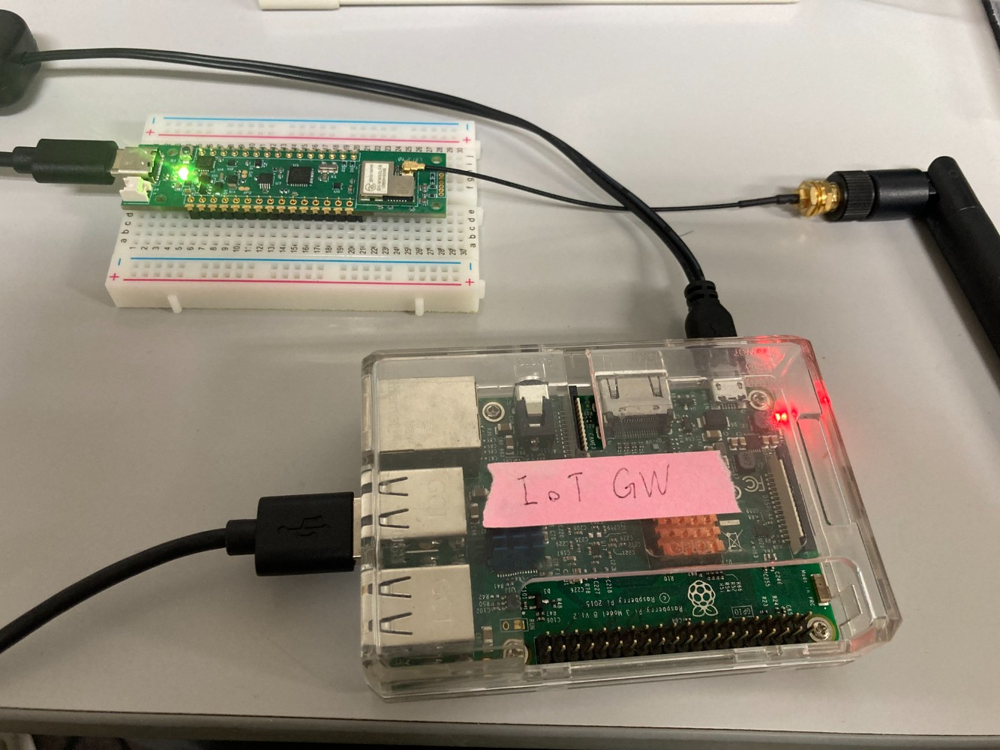

## Lora-serverのセットアップ
Lora-serverはArduinoでLoRaから加速度センサ情報を受取り，その情報をラズパイに渡してSQLへの保存や外部サービスへの連携を想定しています．

## 必要な物
- ラズパイ
- LoRa搭載Arduino-Nano互換ボード(+アンテナ)
	- [https://www.green-house.co.jp/products/gh-evardlrb/](https://www.green-house.co.jp/products/gh-evardlrb/)  
- USB3.1 to USB-Type-Cケーブル
- 半田等の加工は必要としない予定です．

## 完成イメージ


***

# Lora-server(arduino)のセットアップ
Arduinoに以下のコードを流しこみます．  

Arduinoに以下のコードを流しこみます．  
書き込むまでの環境構築等は[こちら](https://www.green-house.co.jp/book/iot-wireless/gh-evardlrb_softwareguide_202111.pdf)を参照

> 追加のボードマネージャのURL  
> [https://raw.githubusercontent.com/GreenHouseBoard/GreenHouse/master/package\_GREEN\_HOUSE\_Arduino\_LoRa\_Test\_index.json](https://raw.githubusercontent.com/GreenHouseBoard/GreenHouse/master/package_GREEN_HOUSE_Arduino_LoRa_Test_index.json)  

ArduinoIDEのライブラリマネージャからDHT sensor libraryをインストール
```
<スケッチ> -> <ライブラリをインクルード> -> <ライブラリを管理> からライブラリマネージャを起動
「DHT sensor library」と検索して，該当するライブラリをインストールしてください．
```

対応する環境に合わせて，スケッチに以下を書き込む．  
**FIXMEでコメントアウトしているところは環境に合わせて設定してください**

```
#define DGHARDUINO_PIN_LORA_POWER (6)
#define DGHARDUINO_PIN_LORA_RESET (7)
#define DGHARDUINO_PIN_LORA_WAKEUP (8)
#define DGHARDUINO_PIN_CPU_LORA_UART_RX (9)
#define DGHARDUINO_PIN_CPU_LORA_UART_TX (10)
#define DGHARDUINO_PIN_CPU_LORA_SDA (A4)
#define DGHARDUINO_PIN_CPU_LORA_SCL (A5)

static const uint16_t u16Channel = 9212;/* チャンネル：921.2Mhz  */
static const uint16_t u16DR = 0;/* Date rate = 0 */

static const char* pFromAddr = "10:01";/* 自身デバイスアドレス 1000.*/
static const uint16_t u16ToAddr = 1000;/*相手デバイスアドレス 1001.*/

/*結果コード begin*/
static const char* respSleep[] ={"Sleep.","AT_ERROR"};
static const char* respOK[] ={"OK","AT_ERROR"};
static const char* respTxDone[] ={"+Finish.","AT_ERROR"};
static const char* respAC[] ={"1000AC","AT_ERROR"};
char* arrayResp[]={"OK","AT_ERROR"};
/*結果コード end*/

struct{
  bool bInitLora = true;
}myWorkarea;
String rfBuf;/* serial1 データ ストリング */
String checkCmd;/*　利用したコマンド ストリング */
char* atCmd;/*　現在コマンド　*/
uint16_t timeLimit = 60000;
bool sendFlg = false;
unsigned long timer = millis();
void setup() {
  // opens serial port, sets data rate to 9600 bp
  Serial.begin(9600);
  Serial1.begin(9600);
  pinMode(DGHARDUINO_PIN_LORA_POWER, OUTPUT);
  pinMode(DGHARDUINO_PIN_LORA_RESET, OUTPUT);
  pinMode(DGHARDUINO_PIN_LORA_WAKEUP, OUTPUT);
  loraPower(true);/*電源ピンをハイに設定する。*/
  loraReset(true);/*リセットピンをハイに設定する。*/
  loraWakeup(true);/*Wake upピンをハイに設定する。*/
}
void loop() {
  if(myWorkarea.bInitLora){
    loraSetup();
  }
 if(!checkResult(serial1Rcv())){/*エラー確認*/
    return;
 }
}

/*****************************************************************************/
/*  名前: checkResult()                                                       */
/*  内容：この関数は、serial1Rcvからの文字列結果をチェックして何かを行います　　　　　     */
/*  例:                                                                       */
/*            スリープ                                             　　　       */
/*            処理ペイロードデータ                                               */
/*            ERROR確認...      　　                                           */
/*  引数:                                                                      */
/*           result:                                                          */
/*                   "payload:00000001"                                       */
/*                   "ATOK"                                                   */
/*  返し結果: true or false                                                     */
/******************************************************************************/
bool checkResult(String result){
  bool returnResult = true;
  if(result!="WAITTING"){
    if((result=="TIMEOUT")||((result.indexOf("AT_ERROR", 0)>=0)&&result.indexOf("at+cipher", 0)<0)){/*エラー確認*/
      checkCmd.remove(0);
      returnResult = false;
    }
    if(result.indexOf("AT+DADDRP", 0)>=0){/*LoRa P2P チャンネルとデバイスアドレス設定完了確認*/
      myWorkarea.bInitLora = false;
    }
    if(result.indexOf("PAYLOAD:", 0)>=0){/* パイロート受信確認*/
      Serial.println(result);
    }
  }
 return returnResult;
}

/********************************************************************************/
/*  名前: sendAT()                                                          　 　 */
/*  内容：この関数は、コマンドを送信し、引数で設定された制限時間までいくつかの確認応答を待ちます. */
/*  引数:                                                                        */
/*           cmd: "AT\r"                                                         */
/*           timelimit: 5000ms                                                   */
/*           resp[]: {"OK","AT_ERROR"}                                           */
/*********************************************************************************/
void sendAT(char* cmd,uint16_t timeNum,char* resp[]){
   if((sendFlg)&&(checkCmd.indexOf(cmd, 0) < 0)){
    atCmd=cmd;
    checkCmd.concat(cmd);
    Serial1.print(cmd);/*Serial1でAT Commandを送信する。*/
    Serial.println();
    Serial.println(atCmd);
    timeLimit = timeNum;
    for(int i = 0; i < sizeof(resp); i++){
      arrayResp[i]=resp[i];
    }
    sendFlg = false;
    timer = millis();
  }
}

/*****************************************************************************/
/*  名前: serial1Rcv()                                                        */
/*  内容:この関数は、シリアルポートからデータを取得し、結果をチェックして、返します。  　   */
/*  結果例:                                                                   */
/*           payload:00000001                                                */
/*           atCmd + get data(ATOK, AT+JOINAT_ERROR,AT+DADDR=?00:11:22:33OK) */
/*           .....                                                           */
/*****************************************************************************/
String serial1Rcv(void){
  String result = "WAITTING";
  if (Serial.available()){
    int inByte = Serial.read();
    if((inByte >= 0x20) && (inByte <= 0x7f)){
      Serial1.print((char)inByte);
    }
    if((inByte == 0x0D) || (inByte == 0x0A)){
      Serial1.print("\r"); 
    }
    timeLimit=60000;
    timer = millis();
    rfBuf.remove(0);
  }
  if (Serial1.available()){
    int inByte = Serial1.read();
    //Serial.write(inByte);
    if((inByte >= 0x20) && (inByte <= 0x7f)){
      rfBuf.concat((char)inByte);
    }
    if((inByte == 0x0D) || (inByte == 0x0A)){
        if(rfBuf.indexOf("RECVP", 0) >= 0){/*受信確認*/
          result = rfBuf.substring(rfBuf.indexOf("PAYLOAD:", 0)+8,rfBuf.indexOf(",HOP:", 0));
          Serial.println();
          Serial.print("PAYLOAD:");

          // NOTE ラズパイからシリアル通信経由でセンサーデータを受け取れるようにASCIIからdecodeして送信し直す処理を追加
          for(int i=0;i<result.length();i+=2){
            char test[50];
            result.toCharArray(test,50);
            sscanf(&test[i], "%2x", &test);
            Serial.write(test);
          }
          //Serial.println(result);
          rfBuf.remove(0);
        }
        if(rfBuf.indexOf("+Rejoin OK.+Finish.", 0) >= 0){/*LoRaWanの設定完了を確認する*/
          result = "Ready.";
          sendFlg = true;
          rfBuf.remove(0);
          delay(10);
        }
        for(int i = 0; i < sizeof(arrayResp); i++){/*結果コード確認*/
          if((rfBuf.indexOf(arrayResp[i], 0) >= 0)&&(rfBuf.indexOf("+Rejoin OK.", 0) < 0)){
              result = atCmd;
              result.concat(rfBuf);
              sendFlg = true;
              rfBuf.remove(0);
            }
          }
    }
  }
  if((!sendFlg)&&(unsigned long) (millis() - timer) > timeLimit){/*タイムアウトチェック*/
    Serial.println("TIMEOUT");
    result = "TIMEOUT";
    Serial.println("\r\r");
    rfBuf.remove(0);
    sendFlg = true;
  }
  return result;
}

/*****************************************************************************/
/*  名前: loraPower()                                                      　 */
/*  内容：電源ピンを設定する。                                                    */
/*****************************************************************************/
void loraPower(bool bOn){
  digitalWrite(DGHARDUINO_PIN_LORA_POWER,bOn);
}

/*****************************************************************************/
/*  名前: loraPower()                                                      　 */
/*  内容：電源ピンを設定する。                                                    */
/*****************************************************************************/
void loraReset(bool bOn){
  digitalWrite(DGHARDUINO_PIN_LORA_RESET,bOn);
}
/******************************************************************************/
/*  名前: loraWakeup()                                                         */
/*  内容：Wake upピンを設定する。                                                 */
/******************************************************************************/
void loraWakeup(bool bOn){
  digitalWrite(DGHARDUINO_PIN_LORA_WAKEUP,bOn);
}
/******************************************************************************/
/*  名前: loraSetup()                                                          */
/*  内容：LoRa P2P チャンネルとデバイスアドレス設定する。                               */
/******************************************************************************/
void loraSetup(){
  sendAT("at+cipher=0\r",5000,respOK);/* cipher key: OFF で設定する */
  char channel[100];
  sprintf(channel, "AT+CHANNELS=P:%u:%u\r", u16Channel, u16DR);
  sendAT(channel,5000,respOK);/* チャンネル: 921.2Mhz DR0（SF12）で設定する */
  char addr[100];
  sprintf(addr, "AT+DADDRP=%s\r", pFromAddr);
  sendAT(addr,5000,respOK);/* デバイスアドレス: 0x1001で設定する */
}
```

## Lora-server(ラズパイ)のセットアップ
- RaspberryPiOSを想定

- もろもろの設定
```bash
sudo apt-get update
sudo apt-get install -y build-essential tk-dev libncurses5-dev libncursesw5-dev libreadline6-dev libdb5.3-dev libgdbm-dev libsqlite3-dev libssl-dev libbz2-dev libexpat1-dev liblzma-dev zlib1g-dev libffi-dev
wget https://www.python.org/ftp/python/3.7.3/Python-3.7.3.tgz
sudo tar zxf Python-3.7.3.tgz
cd Python-3.7.3
sudo ./configure
sudo make -j 4
sudo make altinstall
echo "alias python=/usr/local/bin/python3.7" >> ~/.bashrc
source ~/.bashrc
```

- ambientの準備
```bash
sudo pip3 install git+https://github.com/AmbientDataInc/ambient-python-lib.git
pip3 install schedule

# インストールができたか確認
pip freeze | grep ambient
```

- mysqlのインストール
```bash
sudo apt-get update
sudo apt-get install mysql-server
```

- mysqlの設定
```bash
sudo mysql -u root -p
CRETE DATABASE loradb;
CREATE USER 'lora'@'localhost' IDENTIFIED BY 'kakkoii_password';
GRANT ALL PRIVILEGES ON loradb.* TO 'lora'@'localhost';
FLUSH PRIVILEGES;
quit

mysql -u lora -p
USE loradb;
CREATE TABLE lora_acceleration (dt DATETIME, x int, y int, z int);

# 以下3行やらなくてもいいです
INSERT INTO lora_acceleration VALUE(Now(), 200,200,200);
select * from lora_acceleration;
DELETE FROM lora_acceleration;
```

- プログラムの準備・実行
```bash
pip install mysqlclient
vi getSerialValue.py  
```

対応する環境に合わせて，スケッチに以下を書き込む．  
**FIXMEでコメントアウトしているところは環境に合わせて設定してください**
```python
import serial
import time
import datetime
import MySQLdb
import ambient
import schedule

# FIXME sql connectの引数を適切な値に変更
conn = MySQLdb.connect(host="localhost", db="loradb", user="lora", passwd="kakkoii_password", charset="utf8")
cursor = conn.cursor()

# FIXME /dev/tty以下は環境に合わせて設定してください
# コマンドライン上で ls /dev/tty* と入力して，該当するUSBポートのIDを取得してください
ser=serial.Serial('/dev/ttyUSB0', 9600)
print('connected.')

# FIXME チャネルID，ライトキーを環境に合わせて設定する
am = ambient.Ambient(55555, "9b6XXXXX")

# TODO デバイスIDを取得する
# job1は加速度センサ+温湿度センサを使用している場合に稼動するambient送信用関数
def job1(x, y, z, hum, temp):
    dt = datetime.datetime.now()
    r = am.send({"created":dt.isoformat(), "d1":x, "d2":y, "d3":z, "d4":hum, "d5":temp})
    print('sent to Ambient (ret = %d)' % r.status_code)

# job2は加速度センサのみ使用している場合に稼働するambient送信用関数
def job2(x, y, z):
    dt = datetime.datetime.now()
    r = am.send({"created":dt.isoformat(), "d1":x, "d2":y, "d3":z})
    print('sent to Ambient (ret = %d)' % r.status_code)

while True:
    try:
        raw=ser.readline() # byte code
        strValue=raw.decode('utf-8') # decoded string
        if strValue.startswith('PAYLOAD'): # PAYLOAD:x:708,y:504,z:513.hum:52.30,temp:28.80
            p = strValue[8:] # x:708,y:504,z:513,hum:52.30,temp:28.80
            pl = p.split(',') # ['x:708', 'y:504', 'z:513', 'hum:52.30', 'temp:28.80']
            x = pl[0] # 'x:708'
            y = pl[1] # 'y:504'
            z = pl[2] # 'z:513'
            if len(pl) > 3: # 加速度センサ+温湿度センサを使用している場合
                hum = pl[3]
                temp = pl[4]
                sql = "insert into lora_acceleration value(now(), %s, %s, %s, %s, %s)" % (x[2:], y[2:], z[2:], hum[4:], temp[5:])
                print(sql)
                cursor.execute(sql)
                conn.commit()
                job1(int(x[2:]),int(y[2:]),int(z[2:]),float(hum[4:]),float(temp[5:]))

            else: # 加速度センサのみ使用している場合
                sql = "insert into lora_acceleration value(now(), %s, %s, %s, NULL, NULL)" % (x[2:], y[2:], z[2:])
                print(sql)
                cursor.execute(sql)
                conn.commit()
                job2(int(x[2:]),int(y[2:]),int(z[2:]))

    except Exception as e:
        print('===output error ===')
        print('type:' + str(type(e)))
        print('args:' + str(e.args))
        print('message:' + e.message)
        print('error:' + str(e))
        cursor.close()
        conn.close()
        break

print("end")
```

- ターミナルに戻って実行
```bash
python3 getSerialValue.py
```

以上でArduinoからシリアル通信経由で受け取った加速度センサ情報を，SQLやanbientへ格納できるようになります．